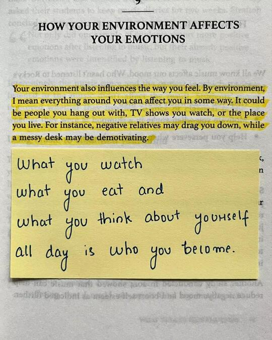
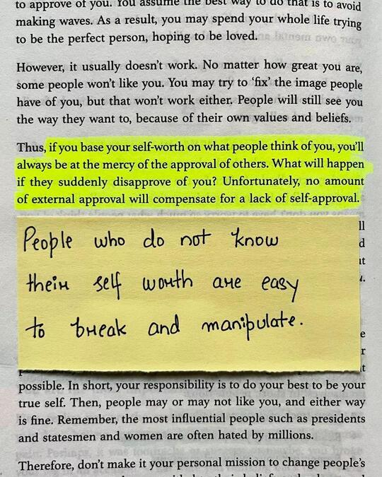
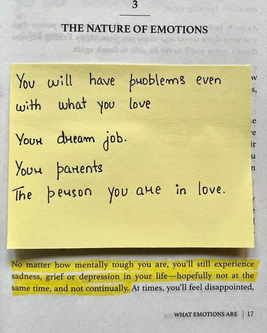
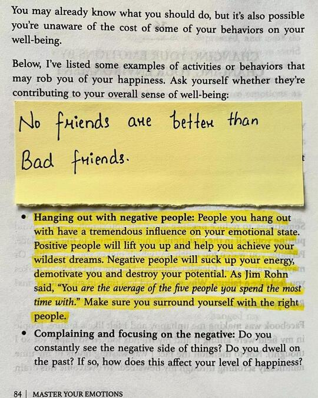
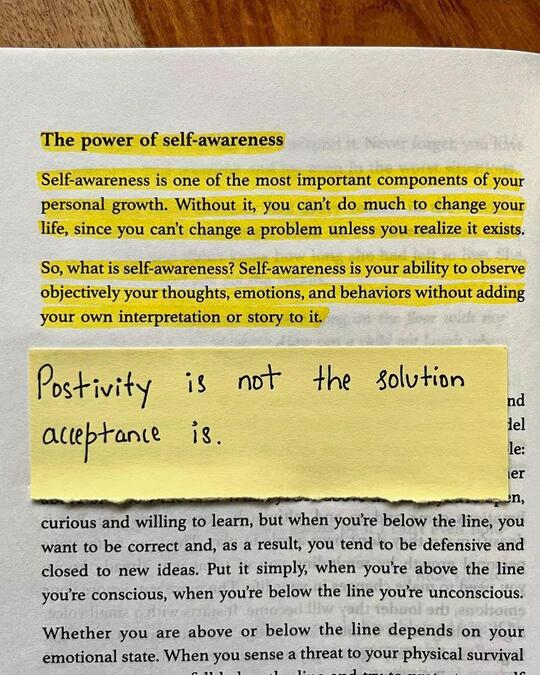

### 📖Overview

"Master Your Emotions" provides a deep dive into how emotions work, how they affect our lives, and practical strategies to control and leverage them. Thibaut Meurisse breaks down emotional management into actionable steps, giving readers tools to better handle emotions and develop a positive, resilient mindset.

---

  

**Summary:**  This passage emphasizes the powerful impact of our environment on our emotions and overall mindset. Everything in our surroundings, including the people we interact with, the media we consume, and our physical space, can shape our mood and motivation. Negative influences, such as critical people or cluttered spaces, can drain our energy, while positive surroundings can uplift us. The note further highlights the importance of being mindful of what we consume physically and mentally, as it ultimately shapes our identity and well-being.

In essence, curating a positive environment and being intentional about what we expose ourselves to can lead to a healthier, happier self. 

**Learning:** What you watch ? What you eat ? and What you think about yourself all day is who you become.

---

  

**Summary:** This passage underscores the importance of self-approval over external validation. When self-worth is tied to the opinions of others, it leaves a person vulnerable and dependent on others' approval, which can easily change. True confidence and resilience come from internal validation rather than relying on the unpredictable favor of others. The note adds that a lack of self-awareness regarding one's value can make a person susceptible to manipulation and control, further emphasizing the need for a strong sense of self-worth.

In essence, building internal self-approval and understanding one's value are essential for emotional independence and personal strength.

**Learning:** People who do not know their self-worth are easy to break and manipulate.

---

  

**Summary:** This passage highlights the inevitability of emotional challenges, even for those who are mentally resilient. No matter how strong or emotionally prepared one might be, moments of sadness, disappointment, or grief are a natural part of life. Additionally, the sticky note reminds us that difficulties can arise even in areas we hold dear—such as our career, family, or romantic relationships. The message encourages acceptance of these emotional ups and downs as a normal part of the human experience, rather than something to be avoided or seen as a weakness.

**Learning:** 
    - You will have problems even with what you love.
    - Your dream job.
    - Your parents.
    - The person you are in love.

---

  

**Summary:** The image emphasizes the importance of surrounding oneself with positive people and avoiding negativity. It highlights how negative influences, such as hanging out with toxic individuals or constantly focusing on the negative aspects of life, can significantly impact one's happiness and well-being. The quote "You are the average of the five people you spend the most time with" reinforces this idea, suggesting that the company we keep can shape our mindset and overall outlook on life.

The image encourages readers to be mindful of their social circle and to prioritize relationships with uplifting and supportive people. It also suggests that cultivating a positive mindset, by focusing on the positive aspects of life and avoiding dwelling on negativity, can contribute to greater happiness and fulfillment.

**Learning:** No friends are better than Bad Friends.

---

  

**Summary:** The text emphasizes the importance of self-awareness for personal growth. It explains that self-awareness is the ability to objectively observe one's thoughts, emotions, and behaviors without adding personal interpretation or judgment. The text also highlights that positivity is not always the solution, and acceptance is often a more effective approach.

The text further discusses the concept of being "above the line" or "below the line." When we are "above the line," we are curious, open to learning, and willing to accept new ideas. When we are "below the line," we tend to be defensive, closed-minded, and resistant to change. The text concludes by stating that our emotional state determines whether we are above or below the line, and when we sense a threat to our physical or emotional survival, we tend to move below the line.

**Learning:** Positivity is not the solution acceptance is. 

--- 

### 📖Conclusion

A wrap-up emphasizing that emotional mastery is a lifelong journey. By consistently applying these techniques, readers can create a life of greater happiness, resilience, and purpose.

---

:::tip Key Takeaways

- Emotions are deeply connected to our thoughts and can be managed through awareness and deliberate action.
- Environment, habits, and self-talk all play crucial roles in emotional health.
- Building resilience and letting go of negativity are keys to a balanced, joyful life.

:::

