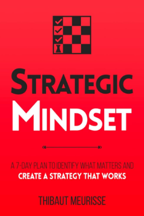

# 📕Strategic Mindset

  
*Cover image for "Strategic Mindset" by Thibaut Meurisse* 

---

### 📖Overview 
In *Strategic Mindset*, Thibaut Meurisse emphasizes the importance of developing a clear and goal-oriented mindset to improve decision-making and achieve personal and professional success. The book dives into practical strategies for setting goals, overcoming obstacles, and staying disciplined, enabling readers to cultivate habits that support long-term achievement. Meurisse uses actionable insights to help readers focus on what truly matters, outlining techniques to manage time, boost productivity, and stay resilient against setbacks.

*Strategic Mindset* combines principles from psychology, self-help, and business to create a guide for anyone looking to achieve consistent growth. Meurisse encourages readers to adopt a proactive approach to life, use mental models to navigate complexity, and optimize their actions for meaningful results.

---

### 📖Conclusion
The book concludes with a reminder that success is a process of constant improvement and strategic action. Meurisse underscores that adopting a strategic mindset isn’t a one-time change but a lifelong journey requiring perseverance, adaptability, and a commitment to self-growth. By following the steps outlined, readers can cultivate a mindset that enables them to navigate challenges, seize opportunities, and make intentional choices that align with their goals and values. Meurisse advocates for continuous learning, self-awareness, and personal accountability as key components of sustained success.

---

:::tip Key Takeaways

1. **Clarity of Purpose**: Define clear, specific goals and priorities. Knowing what you want to achieve allows you to direct energy toward meaningful tasks and avoid distractions. 
2. **Strategic Decision-Making**: Use mental models and strategic thinking to make more informed and effective decisions. Being intentional with choices leads to better outcomes. 
3. **Self-Discipline and Consistency**: Success comes from small, consistent actions. Discipline is crucial to stay on course, even when motivation fluctuates.
4. **Resilience and Adaptability**: Obstacles and setbacks are inevitable. Embrace them as opportunities to learn and adapt, using failure as a stepping stone to improvement.
5. **Continuous Growth and Learning**: Cultivate a growth mindset, always seeking to improve skills, expand knowledge, and challenge limiting beliefs.
6. **Time and Energy Management**: Focus on high-impact activities. Prioritize tasks that align with your goals and use time management techniques to enhance productivity.
7. **Personal Accountability**: Take responsibility for outcomes and avoid excuses. Accountability is essential for building a mindset that seeks results rather than comfort.

:::